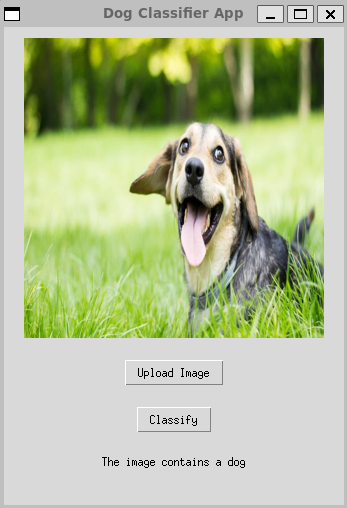

# Image Classification: Dog or Not

This is a binary image classification project in PyTorch. It uses the architecture of MobileNetV2 and the ImageNet pretrained weights. The model was trained on the ImageNet-2012 validation set. 

The data is not included in this repo, but this code can be easily modified for any image-based binary classification task.

The validation accuracy of the model is 98.3%. To test the classification performance of the model on any image, inference.py can be used.

If you have any comments or suggestions about the repo, feel free to let me know.

## Example Use:

